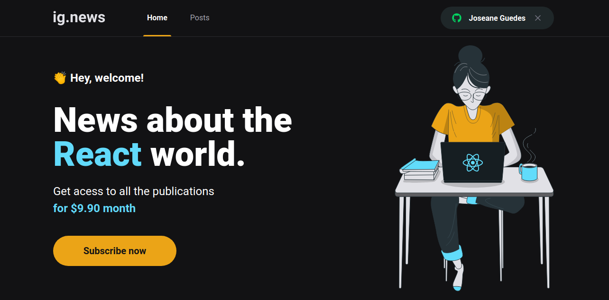
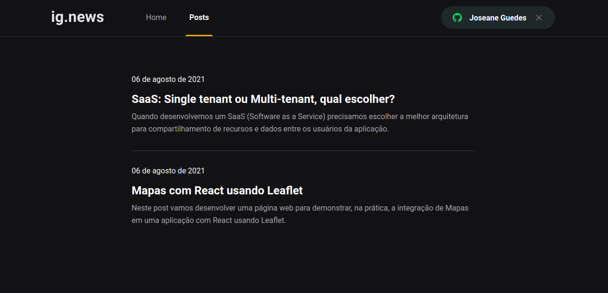

<h1 align="center">   </h1> 

<h1 align="center">  ig.news 📰   </h1> 

<p align="center">	
   
    
  
  
  
  
</p>

<br>

# 👩‍💻About
<p align="justify">Ignews is a trusted source of news, trends, and technology insights for the React community, so stay tuned!</p>

<p align="justify">In this module, we built a great paid blog using the concepts of  <a href="https://jamstack.org/" target="_blank" >Jamstack</a>: A modern web development architecture based on client-side JavaScript, reusable APIs, and prebuilt Markup.</p>

# :art: Layout

<div align="center">
  <p align="center">
    
  </p>
  <p align="center">
    
  </p>
</div>

# :rocket: Tecnologies
- [ReactJS](https://reactjs.org/)
- [NextJS](https://nextjs.org/)
- [TypeScript](https://www.typescriptlang.org/)
- [Stripe](https://stripe.com/docs)
- [Fauna](https://docs.fauna.com/fauna/current/start/index.html)
- [Prismic](https://prismic.io/docs)
- [React Icons](https://react-icons.github.io/react-icons/)
- [SASS](https://sass-lang.com/)
  

# 🔧 Run Locally

Clone the project

```bash
  git clone git@github.com:Joseane-Guedes/ignews.git
```

Go to the project directory

```bash
  cd ignews
```

Install dependencies

```bash
  yarn 
```

Start the server

```bash
  yarn dev 
```
# :closed_book: License

Released in 2021 :closed_book: License

This project is under the [MIT license](./LICENSE).

#

<!-- <p align="center">
   <b> &#60;/&#62; by <a href="https://www.linkedin.com/in/joseane-guedes/">Joseane Guedes</a></b>
</p> -->

Made with :purple_heart: by [Rocketseat](https://rocketseat.com.br/ignite) :rocket: and [Joseane Guedes ](https://github.com/Joseane-Guedes) :woman_technologist: 


